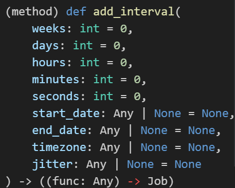
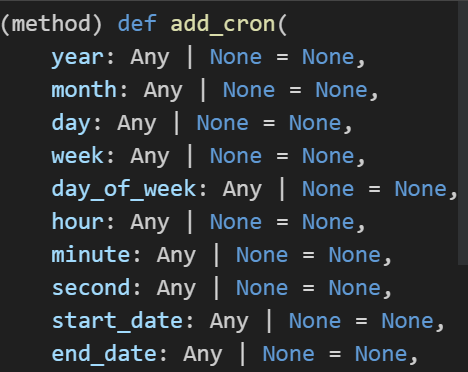

机器人定时任务包含3中不同的方式，其是在`APScheduler`模块上进行的封装

## 1.interval

这是最常用的task类型，其作用是让机器人隔一段时间就来执行一下某一个函数

~~~python
@bot.task.add_interval() # 在这里传入参数，设定任务时间
async def task_interval_def(): # 函数不需要入参
    ...
~~~

具体的参数可以参考编译器的代码补全，所有的参数类型都是字面意思



比如按如下设定，那么机器人就会在开机后开始计时，每1分钟执行一次；

~~~python
@bot.task.add_interval(minutes=1)
async def task1():
	...
~~~

你也可以传入多个时间，最终的执行时间是参数的**和**；

~~~python
@bot.task.add_interval(minutes=26,seconds=20)
async def task2():
	...
~~~


## 2.cron

cron类型task是让机器人到指定时间运行函数，比如：

* 每天的1点0分
* 每周周1的0点
* 每月1日的12点
* ...

你可以通过不同的参数设定，来实现在不同的时间段执行对应的函数；

```python
@bot.task.add_cron() # 传入时间设定参数
async def task_cron_def(): # 函数不需要入参
    ...
```

请注意，为了明确该函数执行的时间，**必须**要给`add_cron`传入`timezone`时区参数，如果想使用东八区，请设置参数为 `Asia/Shanghai` 字符串（其余时区自行百度）

~~~python
# 每天早上8点0分执行函数 (东八区)
@bot.task.add_cron(hour=8, minute=0, timezone="Asia/Shanghai")
async def auto_skin_notify_task():
	...
~~~

具体的传参参考IDE的代码补全



在`APScheduler`的类中可以详细看到每一个入参应该如何传入参数；

其中`day_of_week`参数既可以传入每周的字符串，如mon代表周一、sun代表周日；又可以传入0到6代表周一到周日。请注意，在这个函数中，每一周的**第一天始终是周一**！

~~~python
class CronTrigger(BaseTrigger):
    """
    Triggers when current time matches all specified time constraints,
    similarly to how the UNIX cron scheduler works.

    :param int|str year: 4-digit year
    :param int|str month: month (1-12)
    :param int|str day: day of month (1-31)
    :param int|str week: ISO week (1-53)
    :param int|str day_of_week: number or name of weekday (0-6 or mon,tue,wed,thu,fri,sat,sun)
    :param int|str hour: hour (0-23)
    :param int|str minute: minute (0-59)
    :param int|str second: second (0-59)
    :param datetime|str start_date: earliest possible date/time to trigger on (inclusive)
    :param datetime|str end_date: latest possible date/time to trigger on (inclusive)
    :param datetime.tzinfo|str timezone: time zone to use for the date/time calculations (defaults
        to scheduler timezone)
    :param int|None jitter: delay the job execution by ``jitter`` seconds at most

    .. note:: The first weekday is always **monday**.
    """
~~~

再次提醒，不管你使用那个参数设定运行时间，都需要传入时区参数明确目标时区。

## 3.date

这个task和前两者不同，它只会在设定的时间执行一次任务；

同时，它也可以不传入参数，则函数会在机器人启动后立即执行（注意区分`start_up`任务）

~~~python
@bot.task.add_date()
async def test_date_task():
    ...
~~~

比如按如下方式传入参数，那么机器人就会在启动后过10秒执行一次这个函数

~~~python
from datetime import datetime,timedelta

@bot.task.add_date(( datetime.now() + timedelta(seconds=10)),timezone='Asia/Shanghai')
async def test_date_task():
    ...
~~~

同样的，为了明确运行时间，也需要传入`timezone`时区参数；如果你担心出错，那就无差别地将所有task都传入时区参数，保证无误；

## 4.on_startup

除了上面3个基于`APScheduler`的任务类型之外，还有一个专门的启动任务，其使用方法如下

~~~python
@bot.on_startup
async def bot_start_task(bot: Bot):
	...
~~~

这个任务会在机器人**启动前执行**！

* add_date不传参数时，会在机器人启动后执行，此时机器人已经可以响应命令
* on_startup会在机器人启动之前执行，此时机器人不可以响应命令

你可以根据自己的需要，选择合适的task类型

## 5.on_shutdown

顾名思义，这个函数会在进程收到信号退出的时候执行，比如键入`CTRL+C`（在LINUX下是2号信号）机器人在进程退出之前执行。

适合在内部做一些垃圾回收操作，比如释放数据库链接、将dict的内容以json方式保存到本地文件等操作...

~~~python
@bot.on_shutdown
async def test_shutdown_task(b:Bot):
    ...
~~~

于慕雪个人而言，这个函数并不好用，更加推荐给机器人设立一个只有开发者可以执行的`shutdown`命令，在内部实现垃圾回收+安全退出操作。（通过KOOK用户ID判断是否为开发者，你也可以设定为只有指定的几个用户可以执行，通过`if msg.author_id in list`来判断就行了）


