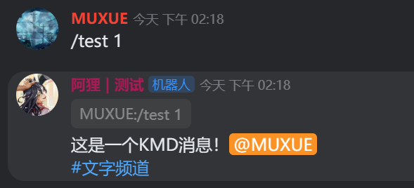
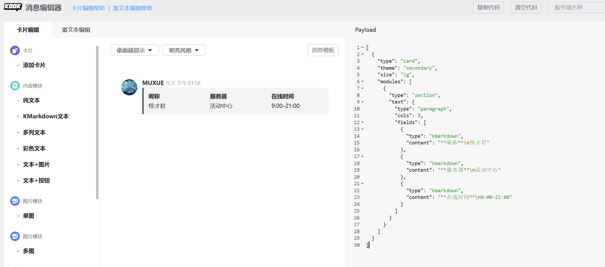
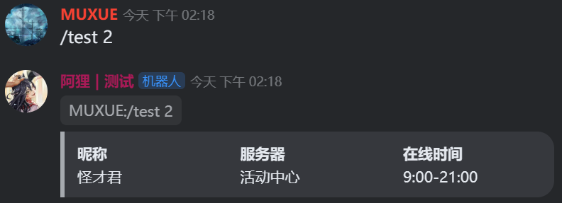
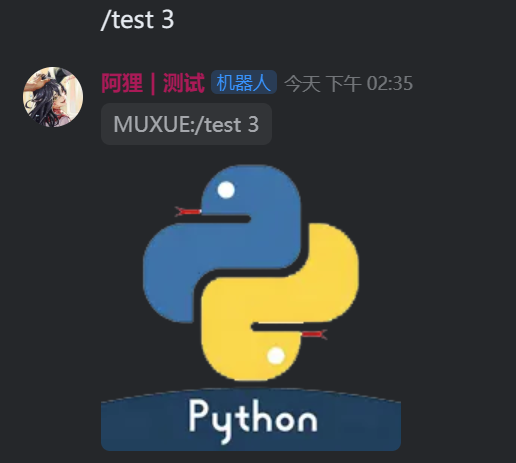

本页面测试代码可见 [code/05.msg.py](../../../code/05.msg.py)

## 1.普通消息（KMD）

当你使用kook客户端，直接发送的消息就是普通的文字消息；

新版本的kook已经用KMD完全替换了 `plain text`，所有发送的消息默认都是KMD格式的消息；

KMD是kook使用的基于markdown语法基础上新增了专属功能的一个文字格式，不管你有没有使用过markdown，都还请阅读 https://developer.kookapp.cn/doc/kmarkdown 内KMD的所有格式。

在khl.py中，机器人默认发送的消息也是KMD格式的

```python
await msg.reply("内容")  # 默认发送的就是KMD消息
```



## 2.卡片消息（CardMessage）

除了最基础的文本消息，kook还有专属的卡片消息，基于json序列化；

卡片消息：https://developer.kookapp.cn/doc/cardmessage

你可以在官网的[卡片消息构造器](https://www.kookapp.cn/tools/message-builder.html#/card)里面构造json的卡片消息



使用如下方法，可以将卡片消息的json，使用卡片消息发送出去;

```python
cm_json = [
    {
        "type": "card",
        "theme": "secondary",
        "size": "lg",
        "modules": [
            {
                "type": "section",
                "text": {
                    "type": "paragraph",
                    "cols": 3,
                    "fields": [
                        {"type": "kmarkdown", "content": "**昵称**\n怪才君"},
                        {"type": "kmarkdown", "content": "**服务器**\n活动中心"},
                        {
                            "type": "kmarkdown",
                            "content": "**在线时间**\n9:00-21:00",
                        },
                    ],
                },
            }
        ],
    }
]
# 发送的时候指定是卡片消息
await msg.reply(cm_json,type=MessageTypes.CARD)
```

khl.py内还封装了 Card,CardMessage 等卡片消息的专门处理类，会在卡片消息的文档页中专门说明。



## 3.附件

人如其名，附件消息说的就是图片、文件等等...

你可以使用如下方式，通过上传图片，获取图片链接，再发送一个图片

```python
# 发送图片
img_url = await bot.client.create_asset('./config/logo.png') # 先上传图片并获取链接
await msg.reply(img_url,type=MessageTypes.IMG)
print(f"send img | {img_url}")
```



请注意，直接发送图片仅仅支持发送机器人自己`create_asset`获取的图片链接，其他图片链接在发送的时候会报错

~~~
khl.requester.HTTPRequester.APIRequestFailed: Requesting 'POST message/create' failed with 40000: 资源不存在
~~~

---

更多消息类型可以在 `MessageTypes`类中看到，不常用的消息类型在这里不做演示

## 4.消息引用

默认情况下，机器人的消息引用始终是打开的，即客户端中的`回复`按钮发送出来的消息。

你可以在`msg.reply`中传入参数禁用消息引用

~~~python
await msg.reply("这是一个没有引用的KMD消息",use_quote=False)
~~~

