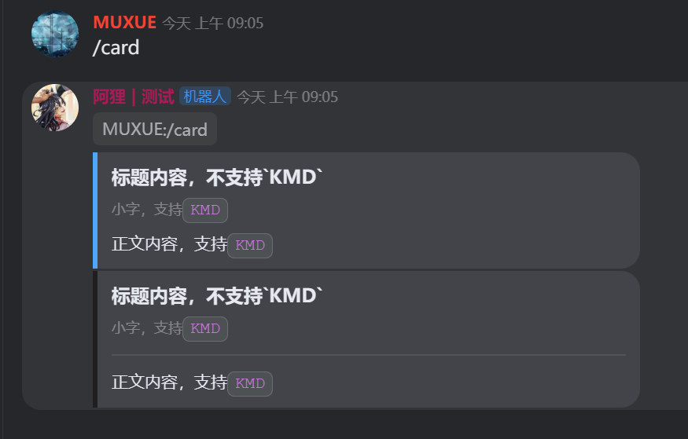

本页面测试代码可见 [code/05.msg.py](https://github.com/musnows/khl.py.docs/blob/main/code/05.msg.py)

## 1.说明

卡片消息的不同格式有很多，基本集中于Card和CardMessage类型中，需要从 `khl.card` 中导入；

~~~python
from khl.card import Card, CardMessage, Module, Types, Element, Struct
~~~

消息发送 `msg.reply()` 函数只接受 CardMessage 对象，一个CardMessage对象最多包含5个Card（超出会无法发送）；

```python
c = Card() # 在这里补充卡片消息的内容（空卡片消息无法发送）
await msg.reply(CardMessage(c))
```

Card和CardMessage本质上是封装了一层Json字符串，CardMessage类型是一个list，你可以使用json模组将其还原成字符串；在卡片消息发送失败的时候，你可以将CardMessage对象转成Json字符串，并去到官方的[卡片编辑器](https://www.kookapp.cn/tools/message-builder.html#/card)中，粘贴Json，查看底部显示的错误信息。

```python
cm = CardMessage() # 假设这是一个完好的卡片消息
print(json.dumps(cm)) # 将卡片消息转换成json字符串
```

## 2.文字

除了标题外，正文和小字都支持KMD，在新版本的khl.py中，已经默认了卡片消息的文字类型为KMD

~~~python
cm = CardMessage()
c = Card(
    Module.Header("标题内容，不支持`KMD`"),
    Module.Context("小字，支持`KMD`"),
    Module.Section("正文内容，支持`KMD`"),
)

cm.append(c)
# 你可以继续往cm中append其他Card对象，最多5个
# cm.append(c1)
await msg.reply(cm)
~~~


如果你使用的是旧版本的khl.py，则可以使用这种方式来指定文字类型为KMD；同时这里也演示了你可以使用`append`将`Moudle`给插入到Card中

~~~python
# 手动指定使用kmd
c1 = Card(
    Module.Header("标题内容，不支持`KMD`")
)
c1.append(Module.Context(Element.Text("小字，支持`KMD`",Types.Text.KMD)))
c1.append(Module.Section(Element.Text("正文内容，支持`KMD`",Types.Text.KMD)))
~~~

效果和上图完全相同；

## 3.分行符

~~~python
c1 = Card()
c1.append(Module.Divider()) # 分隔符
~~~

下图小字和正文之间的横线就是分隔符


## 4.卡片边栏颜色

在构造`Card`类型的时候，可以传入color参数来指定卡片消息边栏的颜色，默认是蓝色

~~~python
c1 = Card(
    Module.Header("标题内容，不支持`KMD`"),
    color='#1f1f1f'
)
~~~

你可以根据你的需要，传入颜色的十六进制值；可以在[在线网站](https://www.sioe.cn/yingyong/yanse-rgb-16/)中查询颜色对应值，搜索关键字“RGB颜色十六进制码”。



## 5.多列文字

卡片消息支持多列文字，最多3列；在每一列的字符串中换行，既可以实现一列多行。

你可以将第一列加粗来作为“表头”，具体请根据你的需求自行决定样式。

~~~python
c2 = Card(
    Module.Section(
        Struct.Paragraph(
            3,
            Element.Text("这是第一列", type=Types.Text.KMD),
            Element.Text("这是第二列", type=Types.Text.KMD),
            Element.Text("这是第三列", type=Types.Text.KMD),
        )
    )
)
~~~


## 6.图片

在卡片消息中，你可以将图片设置成任意**国内可访问**的图片外链链接，也可以先使用`create_asssets`函数将图片上传到kook的图床，获取到链接后，再写入卡片消息中。

请注意，如果你的图片外链国内无法访问或者访问不稳定，则卡片消息会发送失败。强烈建议将图片先上传到kook图床再发送，具体步骤请参考 [图片上传](./02.img.md) 一节；

### 6.1 单图

~~~python
img_src = "https://img.kookapp.cn/attachments/2023-05/29/k2jUQW81GC05k05k.png"
c3 = Card(Module.Container(Element.Image(src=img_src)))
~~~


### 6.2 图片+文字

这里的图片我直接传入了发起命令的用户头像，并设置`alt='left'`让图片显示在文字的左侧

~~~python
c4 = Card(
    Module.Section(
        Element.Text("文字在右侧", type=Types.Text.KMD),
        Element.Image(src=msg.author.avatar, alt="left"),
    )
)
~~~


### 6.3 多图