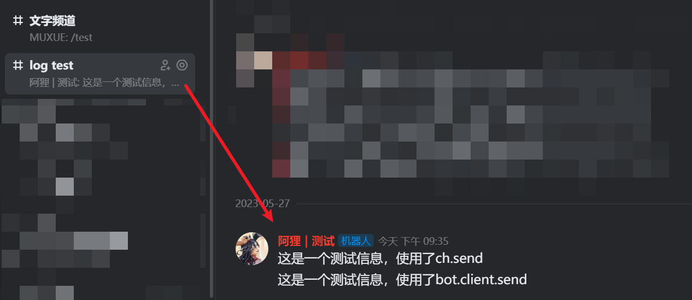

大部分操作都需使用Bot对象来执行，请自行查看Bot对象初始化教程

## 1.获取频道对象

~~~python
ch = await bot.client.fetch_public_channel("文字频道id")
~~~

## 2.发送信息

向频道内发送信息有两种办法

~~~python
# 使用channel对象的send
ret = await ch.send("这是一个测试信息，使用了ch.send") # 方法1
print(f"ch.send | msg_id {ret['msg_id']}") # 方法1 发送消息的id

# 使用bot对象的client.send
ret = await bot.client.send(ch,"这是一个测试信息，使用了bot.client.send") # 方法2
print(f"ch.send | msg_id {ret['msg_id']}") # 方法2 发送消息的id
~~~

卡片消息也是相同的操作，传入`CardMessage`对象即可

## 3.示例

在这个机器人中，注册了一个`test`命令，执行此命令，机器人会往指定频道中，发送两条信息。并在控制台输出这两条信息的 `msg_id`

~~~python
import traceback
from khl import Bot, Cert,Message,Channel
from utils.file import open_file

# 打开config.json
config = open_file('./config/config.json')

# 初始化机器人
bot = Bot(token=config['token'])  # 默认采用 websocket

@bot.command(name='test')
async def test_cmd(msg:Message):
    try:
        print("test cmd recv!")
        ch = await bot.client.fetch_public_channel("3105208745392823") # 获取指定频道
        
        # 使用channel对象的send
        ret = await ch.send("这是一个测试信息，使用了ch.send") # 方法1
        print(f"ch.send | msg_id {ret['msg_id']}") # 方法1 发送消息的id

        # 使用bot对象的client.send
        ret = await bot.client.send(ch,"这是一个测试信息，使用了bot.client.send") # 方法2
        print(f"bot.client.send | msg_id {ret['msg_id']}") # 方法2 发送消息的id
    except:
        print(traceback.format_exc()) # 打印报错详细信息

bot.run()
~~~

私聊机器人，发送`/test`，机器人将执行命令，往频道中发送信息

控制台输出如下

~~~
test cmd recv!
ch.send | msg_id 00e6efd4-52be-41d3-8d5c-bc1dfb7ba1f0
bot.client.send | msg_id 9fe26ea2-6335-456d-8d4a-fad7e8d3c045
~~~

